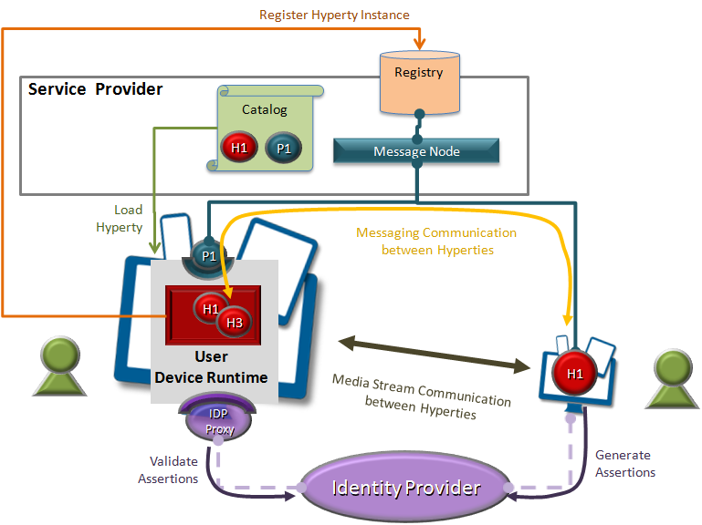

## reTHINK Framework Architecture

The reTHINK architectural functions are based on a series of Hyperties that are generated by the service provider, and are dynamically deployed to the users’ endpoints from a Catalogue Support Service.
The instantiated versions of these hyperties are registered in a Registry Support Service, which represents authenticated users who are available for in-coming communication requests service.
Therefore, the Registry serves as a location manager and is used for user discovery.
Hyperties running in different devices communicate through Service Providers' Messaging Node or through P2P channels.
Communications between Hyperties are secured with tokens generated and validated by independent Identity Providers through IdP Proxies that are dynamically deployed to the users' endpoints from a Catalogue Support Service.

**Hyperty Runtime -** The Hyperty Runtime supports the execution of Hyperties providing all required functionalities to securely manage its life-cycle, only consuming back-end support Services when strictly required.
The Runtime design enables the reuse of the core runtime components through different platforms including Browsers, Standalone Mobile Application, Network Side Application Servers and more constrained M2M/IoT standalone devices. More information [here](runtime.md).

**Message Node -** provides real time message oriented communication functionalities used by Hyperties to communicate (Message Routing). They should provide different communication patterns including publish/subscribe communication.  

**Domain Registry -** Where Service instances and associated End-users are registered and discoverable.
In reTHINK context, Registry are used to manage the registration and discovery of Hyperty instances and Hyperty Data Objects.
The discovery of End-users associated to Hyperty instance may imply the usage of IdM functionalities eg for authorisation purposes or when Identifier used in the discovery is different from the one used by the Hyperty Instance.

**Hyperty Catalogue -** Provide access to Services assets including service descriptions, software services, policy, documentation, and other assets or artifacts that are essential to the operation of the service.

**Identity Management/Identity Provider -** Verifies the Identity of an End-User, provides End-user authentication, authorisation and access to End-User profile information. User Id can be determined by different kind of identifiers: email, webID, OpenID, URL, mobile phone number or any other global identifier, and may have more than one authentication factor.
